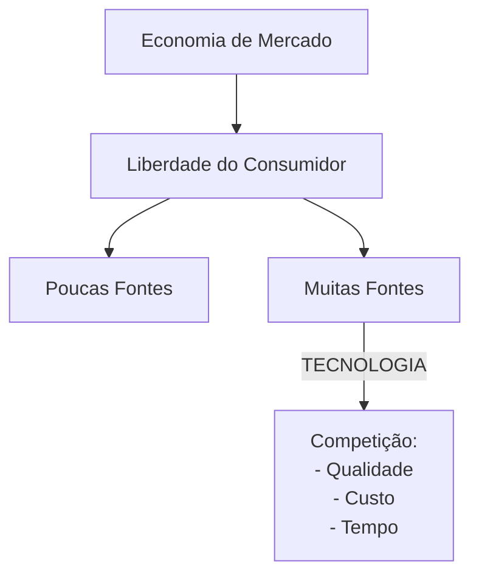

###### Aula 02 - 21.03
**Próxima aula:** [[MRSP - Fornecimento]] (Aula 03 - 26.03)

---
# Economia de Mercado

```mermaid
graph TB

A[Economia de Mercado] --> B[Liberdade do Consumidor]
B --> C[Poucas Fontes]
B --> D[Muitas Fontes]

D --TECNOLOGIA--> E[Competição: 
- Qualidade
- Custo
- Tempo]

```

---
**tags:** #tecnologia #economiaDeMercado
**Home:** [[#Aula 02 - 21.03]]