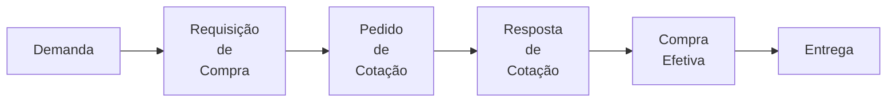

###### Aula 03 - 26.03
**Aula Anterior:** [[Introdução]] (Aula 02 - 21.03)
**Próxima aula:** [[MRSP - Produção]] (Aula 04 - 28.03)

---
# MRSP - Fornecimento
## Como definir uma política de gestão de estoques de matéria-prima (classificação)?
### ABC (Econômico)
É uma metodologia de análise que categoriza itens com base em seu valor ou importância. É uma ferramenta poderosa para otimizar a gestão de diversos setores em uma empresa, desde o estoque até o marketing e finanças.
#### Regra 80/20
Baseado na **Regra 80/20**, ou *Princípio de Pareto*, quer representar que **80% dos resultados vêm de apenas 20% das causas.**
- 20% dos itens (**Classe A**) contribuem para **80%** do valor total
- 30% dos itens (**Classe B**) contribuem para **15%** do valor total
- 50% dos itens (**Classe C**) contribuem para **5%** do valor total
### PQR (Popularidade)
Metodologia para classificar os **itens do estoque** em  três grupos conforme a **frequência de demanda** em um determinado período, os itens são classificados em:
- **P - Popular:** *Itens com alta rotatividade*, representa a maior parte das vendas e movimentação do estoque
- **Q - Quase Popular:** *Itens com demanda intermediária*, menos frequentes que a classe P, porém ainda relevante para o negócio
- **R - Raro:** *Itens com baixa demanda*, que representa uma parte menor das vendas e movimentações
### XYZ (Criticidade)
Metodologia para classificar de acordo com a **criticidade** do item para as operações da empresa, ou seja, o quanto a ausência do item pode consegue afetar o processo de produção. Classificados em:
- **Classe X - Baixa Criticidade:** a falta desses itens não afetam no processo de produção, não gera riscos de segurança ou danos ao patrimônio.
- **Classe Y - Média Criticidade:** a falta desses pode causar uma parada na produção, riscos de segurança ou danos. Relativamente fáceis de serem substituídos.
- **Classe Z- Alta Criticidade:** a falta desses causam parada na produção e colocar em risco as pessoas e patrimônio. Sua aquisição é demorada e complicada.
### 123 (Complexidade de Aquisição)
Metodologia para classificar de acordo com o quão fácil é a **aquisição** de um determinado item, depende de vários fatores como: importação, tempo de fabricação, liberações, limitações de mercado, etc...
- **Grupo 1 - Complexo:** Aquisição mais complexa e demorada
- **Grupo 2 - Difícil:** Média complexidade de tempo de aquisição
- **Grupo 3 - Fácil:** Aquisição de entrega rápida e sem complexidade

## Como selecionar fornecedores de maneira adequada?
- **Considerações Estratégicas**
- Utilização de ferramentas e métodos de apoio à decisão
	- Brainstorming
	- Mapa Mental
	- Diagrama de Fluxo
	- Matriz de Decisão
	- Análise SWOT
- Critérios *Quantitativos*
- Critérios *Qualitativos*

## Quais os aspectos básicos envolvidos em um processo de compras?

## Como definir o modal de transporte mais adequado?
### Critérios típicos para a decisão

| **Características** | Ferroviária | Rodoferroviária | Aquário | Dutoviário | Aéreo |
| :-----------------: | :---------: | :-------------: | :-----: | :--------: | :---: |
|   **Velocidade**    |      X      |        X        |    X    |     X      |   X   |
| **Disponibilidade** |      X      |        X        |    X    |     X      |   X   |
| **Confiabilidade**  |      X      |        X        |    X    |     X      |   X   |
|   **Capacidade**    |      X      |        X        |    X    |     X      |   X   |
|   **Frequência**    |      X      |        X        |    X    |     X      |   X   |
|    **Resultado**    |      X      |        X        |    X    |     X      |   X   |
## Decisão *Make or Buy*
É um tipo de decisão aonde visa definir se os produtos serão **fabricados internamente** ou se serão **adquiridos por terceiros** (fornecedores). É uma decisão baseada em *múltiplos critérios*, como:
- Custos
- Qualidade
- Volume
- Tecnologia
- Riscos
- Flexibilidade
- Competências
## Quais as políticas básicas de controle de estoques?
### Revisão Periódica
- Tempo **fixo**
- Lote **variável**
### Lote Econômico
- **Lote** **fixo**
- Tempo **variável**

---
**tags:** #MRSP #ABC #PQR #XYZ #123_ #SWOT
**Home:** [[#Aula 03 - 26.03]]