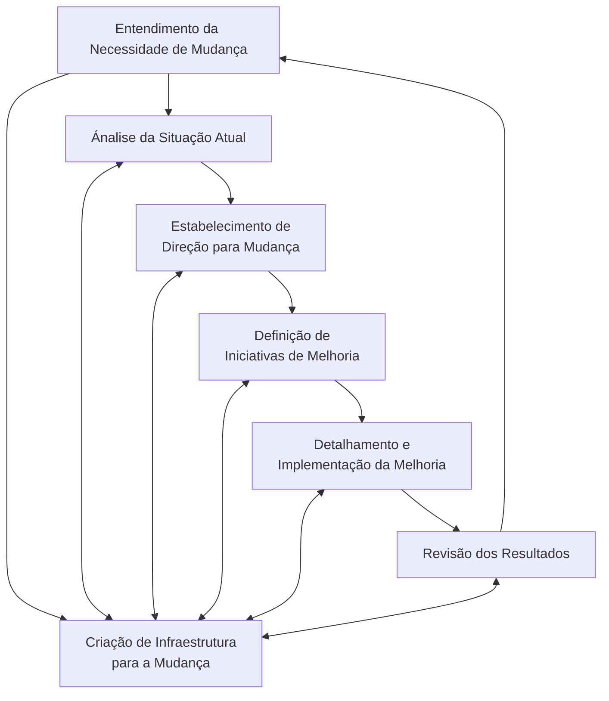

 ###### Aula 07 - 09.04
**Aula Anterior:** [[MRSP - Design e Gerenciamento Organizacional]] (Aula 06 - 04.04)
**Próxima Aula:** [[Engenharia de Produto]] (Aula 08 - 11.04)

---
# MRSP - Inovação e Melhoria
## Quais são as principais fases de um processo de transformação organizacional?

## Qual a importância de uma metodologia para a condução de um processo de melhoria?
- **Foco:** A metodologia define claramente os objetivos do processo de melhoria, garantindo que todos os esforços estejam direcionados para alcançá-los.
- **Organização:** Divide o processo em etapas sequenciais e bem definidas, facilitando o planejamento, a execução e o monitoramento das atividades.
- **Eficiência:** Permite a otimização do tempo e dos recursos, evitando retrabalho e desperdícios.
- **Comunicação:** Facilita a comunicação entre os membros da equipe, garantindo que todos estejam alinhados quanto aos objetivos, responsabilidades e prazos.
- **Aprendizado:** Promove o aprendizado contínuo, pois permite a documentação das experiências e boas práticas, que podem ser utilizadas em futuros processos de melhoria.
- **Cultura de melhoria contínua:** Contribui para a criação de uma cultura de melhoria contínua na organização, incentivando a busca constante por oportunidades de aprimoramento.

## Aponte ferramentas chaves associadas a processos de  transformação e melhoria organizacional
- Modelagem de Processos
- Mapeamento do Fluxo de Valor (Lean)
- Diagrama de Ishikawa
- Árvore da Realidade Atual (ARA)

## O que são certificações de empresa?
São atestados formais que comprovam que a gestão da organização está em conformidade com padrões e normas reconhecidos internacionalmente. Elas são emitidas por organismos independentes e acreditados, após a realização de uma auditoria rigorosa que avalia os processos, produtos e serviços da empresa.

- **ISO 9001:** Gestão da Qualidade
- **ISO 14001:** Gestão Ambiental
- **OHSAS 18001:** Saúde e Segurança Ocupacional
- **ISO 27001:** Segurança da Informação
- **SA 8000:** Responsabilidade Social
- **LEED:** Liderança em Energia e Design Ambiental

## Quais são as 7 principais ferramentas da qualidade?
1. Fluxograma
2. Diagrama de Causa e Efeito (Ishikawa)
3. Folha de Verificação
4. Diagrama de Pareto
5. Histograma
6. Diagrama de Dispersão
7. Cartas de Controle ou Controle Estatístico do Processo (CEP)

---
**tags:** #MRSP #Ishikawa #CEP #DiagramaDePareto #ISO #LeanProduction #ARA
**Home:** [[#Aula 07 - 09.04]]