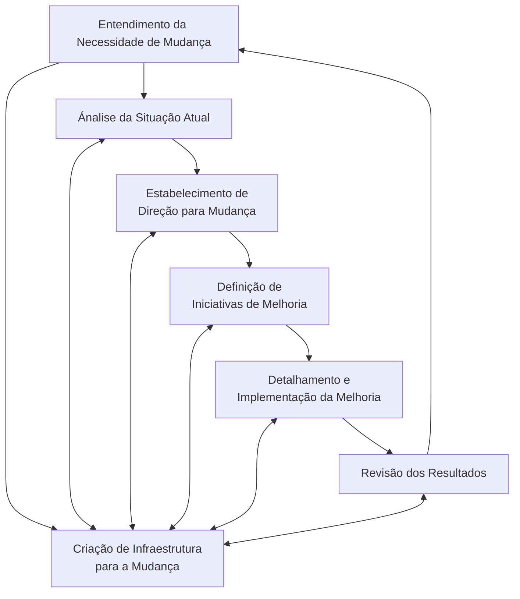

 ###### Aula 07 - 09.04
**Aula Anterior:** [[MRSP - Design e Gerenciamento Organizacional]] (Aula 06 - 04.04)
**Próxima Aula:** [[Engenharia de Produto]] (Aula 08 - 11.04)

---
# MRSP - Inovação e Melhoria
## Quais são as principais fases de um processo de transformação organizacional?

## Qual a importância de uma metodologia para a condução de um processo de melhoria?

## Aponte ferramentas chaves associadas a processos de  transformação e melhoria organizacional
- Diagrama de Ishikawa
- Árvore da Realidade Atual (ARA)

## O que são certificações de empresa?

---
**tags:** #MRSP 
**Home:** [[#Aula 07 - 09.04]]