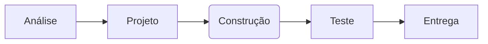
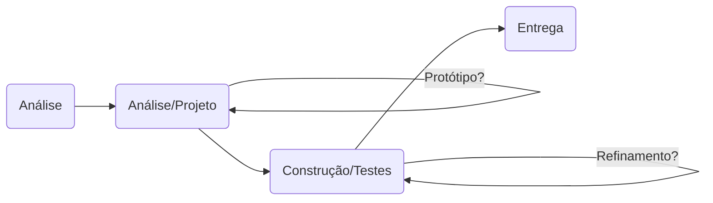

###### Aula 03 - 25.03
**Aula Anterior:** [[Introdução]] (Aula 02 - 20.03)
**Próxima Aula:** [[Scrum e XP]] (Aula 05 - 01.04)

---
# Ciclos de Vida
Conjunto de etapas que ocorrem entre a concepção de um sistema e o instante em que novas versões do produto de software é entregue ao cliente, ou seja, possuem seu **inicio**, **meio** e **fim**.
Ajuda na orientação da equipe quais os próximos passos a serem tomados.

## Desenvolvimentos
### Desenvolvimento Direcionados por Planos
- Grande esforço no planejamento inicial do projeto
- Identificação e especificação completa do requisitos para poder continuar
- Na medida que o problema é mais compreendido seus requisitos são aumentados
#### Consequências:
 - Mais demorados com sujeito a mudanças 
 - Sobrecarga de planejamento, desenvolvimento e documentação

>**NOTA:** Útil para sistemas mais complexos que demandam bastante cautela em seu desenvolvimento. Ex: *Sistemas aeronáuticos*, *Sistemas de UTI*, etc.

### Desenvolvimento Ágil
- Entregas contínuas de produto de valor (*incrementos*)
- Mudanças no projeto são bem-vindas
- Ambiente motivador para trabalho
- Equipes auto organizáveis
- Simplicidade maximizando o trabalho que não precisa ser feito
- **Voltado a negócios**

## Tipos de Ciclo de Vida
### Tipo Preditivo
É o tipo mais *clássico* dos ciclos de vida, primeiro a tentar organizar a maneira de desenvolvimento de software.
- Maior parte do processo acontece no inicio (*planejamento*)
- Processo executado **sequencialmente** em etapas, que geram resultados para a próxima
- Requisitos *conhecidos* e *estáveis*

#### Mudanças
- Provocadas por erros e geram **manutenções corretivas**
- Adaptação ao ambiente *externo*
- Acréscimo de de funcionalidades e desempenhos, **manutenções perfectivas**
- Alteração do seu conteúdo functional, **manutenção evolutivas**

### Tipo Iterativo
Criado para resolver problemas do [[#Tipo Preditivo]] com **entregas frequentes e de valor** em um ambiente com *instabilidade* e *volatilidade*.
- Diz respeito a uma quantidade de tempos (*time box*) para entregar um determinado conteúdo
- A repetição gera um *refinamento* até a entrega total do produto

### Tipo Incremental
Nesse modelo o projeto é construído e entregue por **partes**, porém cada um tem um **subconjunto de funcionalidades completas, que terão *feedbacks* coletados e requisitos revistos nas iterações**.
- Prevê a divisão em *miniprojetos*, com sistemas parciais para a produção de um sistema final

### Tipo Iterativo e Incremental
É a junção dos dois modelos anteriores que vem como uma solução para demandas que necessitam de **liberação antecipada ou rápida**.
- Neste modelo as estimativas de **tempo** e **custos** são modificadas rotineiramente
- Os *feedbacks* obtidos a cada *sprint* vão produzir melhorias na próxima *iteração*

## Modelo de Prototipação para Obtenção de Requisitos
Seu maior objetivo é **entender profundamente os requisitos** do usuário, afim de melhorar as definições do sistema. Esse entendimento proporcionado pela *tangibilidade* dos requisitos propostos com a apresentação do protótipo.

#### Problemas
- Em uma abordagem pode fazer o protótipo se tornar o **produto final.**
	- Demora do usuário a perceber o seu *real* produto final
- Em outra o protótipo é utilizado apenas para a compreensão do produto e então descartado para a produção do produto final
	- A rapidez da implementação pode interferir na qualidade do produto final

---
**tags:** #agil #preditivo #planos #incremental #waterfall #timebox #sprint #prototipos