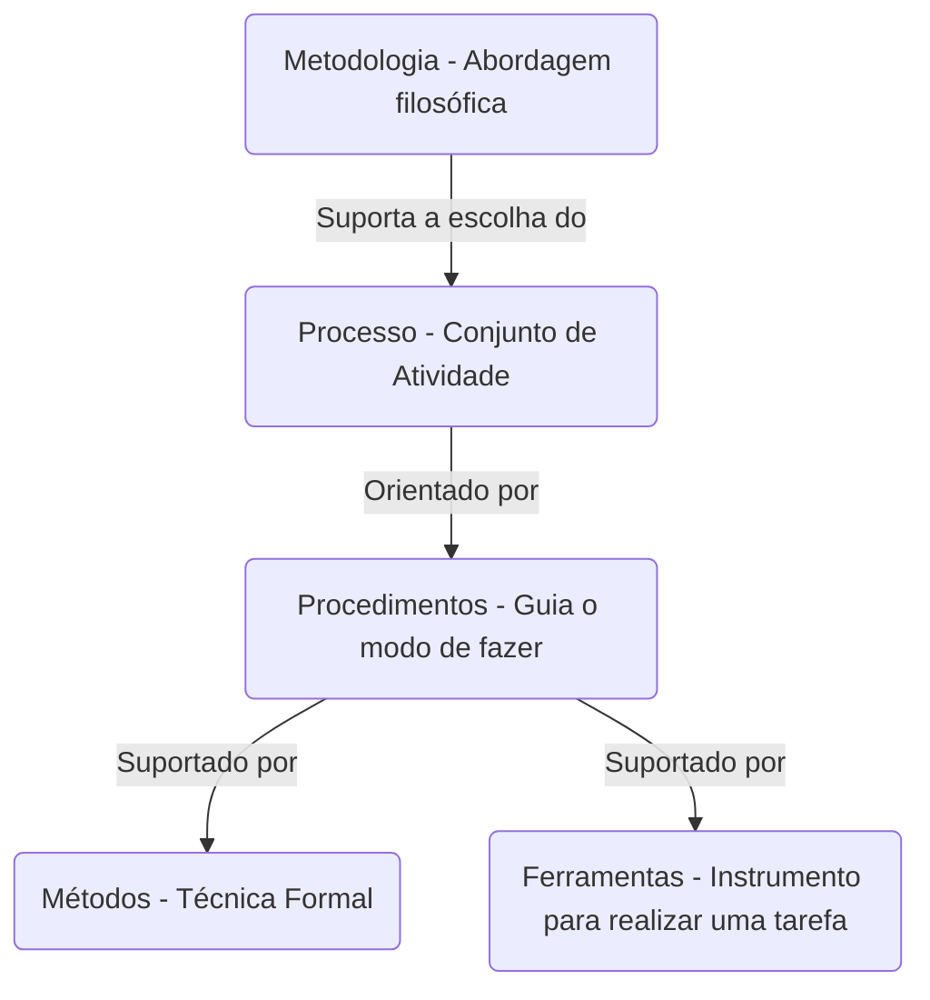

###### Aula 02 - 20.03
**Próxima Aula:** [[Ciclos de Vida]] (Aula 03 - 25.03)
# Projeto
Empreendimento único realizado por atividades controladas e coordenadas com datas especificas para cada etapa para que alcance um requisito pré-estabelecido. 

> Podem tem vários [[Ciclos de Vida]] (Aula 03 - 25.03) diferentes

## Relacionamento entre Conceitos

## Passos Iniciais
### Entender o problema
- Entender as causas principais do problema a ser resolvido ([Diagrama de Ishikawa]([Diagrama de Ishikawa: o que é, para que serve e como usar (napratica.org.br)](https://www.napratica.org.br/diagrama-de-ishikawa/)))
- *Identificar*, *esclarecer* e registrar os **requisitos** do negócio
- *Elaborar* soluções e escolher a melhor que atenda: o cliente, as limitações econômicas e as tecnologias disponíveis

### Gerenciar
É o processo de *planejar* a execução, *administrar* os problemas e *controlar* o projeto para que todas as metas sejam atendidas dentro do escopo estabelecido.

### Estilos
- **PMBOK** (Mais formal e documental)
- **Ágil** (Possui certo formalismo porém foca mais no produto)

# Project Management Body of Knowledge (PMBOK)
A entrega de cada fase deve ser tangível e de fácil identificação.

## Fases
1. Iniciação
2. Planejamento
3. Execução
4. Controle
5. Finalização

---
**tags:** #projetos #agil #PMBOK #EAP