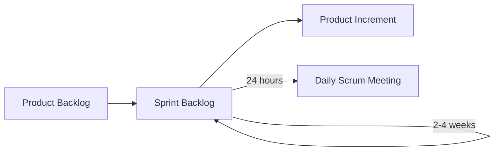

###### Aula 05 - 01.04
**Aula Anterior:** [[Ciclos de Vida pt.1]] (Aula 03 - 25.03)
**Próxima Aula:** [[]] (Aula 06 - 03.04)

---
# Scrum
- Baseado no **empirismo** e **lean thinking**.
	- **Empirismo:** conhecimento vem da experiência e tomada de decisões.
	- **Lean Thinking:** Foca apenas no essencial
- Framework *leve* que auxilia a gerar valor por meio de **soluções adaptativas** para problemas complexos.
- Ele é incompleto para que a teoria seja implementada da maneira mais cabível diante da "situação que está se resolvendo".
- **Iterativo** e **Incremental**.

# XP
- **Estilo de desenvolvimento** de software com foco nas *técnicas de programação, comunicação clara e trabalho em equipe*.
- **Feedback rápido** para melhorar a comunicação
- Um conjunto de princípios complementares, técnicas intelectuais para traduzir os valores em prática.
- **Testes automatizados**
- **Incremental**
- 

---
**tags:** #scrum #xp #agile #framework