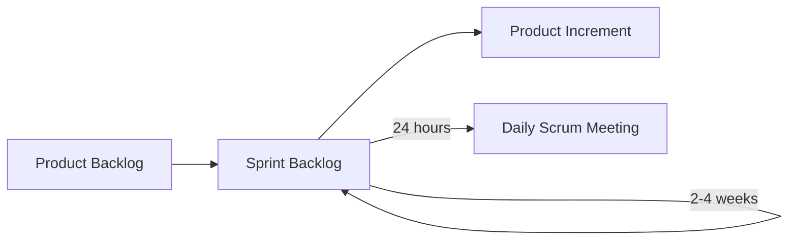

###### Aula 05 - 01.04
**Aula Anterior:** [[Ciclos de Vida]] (Aula 03 - 25.03)
**Próxima Aula:** [[XP]] (Aula 06 - 03.04)

---
# Scrum
O Scrum é um **framework ágil** que revolucionou a gestão de projetos, substituindo a rigidez de métodos tradicionais por um ambiente colaborativo e adaptável. Inspirado no rúgbi, o Scrum usa times auto organizados para entregar valor de forma rápida e incremental, driblando as incertezas e os desafios do mundo moderno.

- Baseado no **empirismo** e **lean thinking**.
	- **Empirismo:** conhecimento vem da experiência e tomada de decisões.
	- **Lean Thinking:** Foca apenas no essencial
- Framework *leve* que auxilia a gerar valor por meio de **soluções adaptativas** para problemas complexos.
- Ele é incompleto para que a teoria seja implementada da maneira mais cabível diante da "situação que está se resolvendo".
- **Iterativo** e **Incremental**.

## Funcionamento
- **Sprints:** O trabalho é dividido em sprints, ciclos curtos de tempo (geralmente 2 semanas) com foco em entregas específicas.
- **Planejamento:** A equipe se reúne no início do sprint para definir o que será feito, estimando o tempo e a dificuldade das tarefas.
- **Execução:** O time trabalha em conjunto, com comunicação constante e adaptação às mudanças.
- **Revisão:** Ao final do sprint, a equipe demonstra o que foi feito e recebe feedback.
- **Retrospectiva:** A equipe reflete sobre o sprint, buscando identificar pontos fortes, fracos e oportunidades de melhoria.

## Vantagens e Desvantagens

| **Vantagens** |      **Desvantagens**      |
| :-----------: | :------------------------: |
| Flexibilidade |    Custo de Treinamento    |
|  Comunicação  | Falta de Clareza no início |
|   Motivação   | Necessidade de Disciplina  |
| Produtividade |            ---             |
| Transparência |            ---             |

---
**tags:** #scrum #agile #framework #sprint #leanThinking #iterativo #incremental
**Home:** [[#Aula 05 - 01.04]]