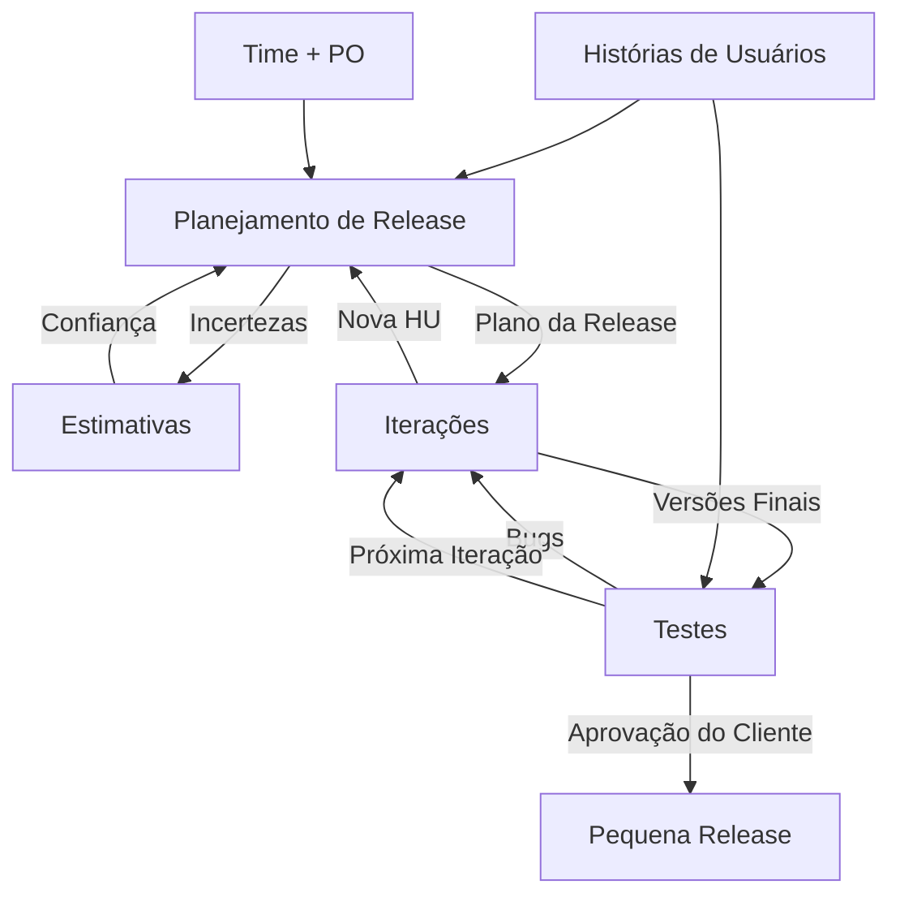

###### Aula 06 - 03.04
**Aula Anterior:** [[Scrum]] (Aula 05 - 01.04)
**Próxima Aula:** [[]] (Aula 07 - 08.04)

---
# XP
O eXtreme Programming, é uma metodologia de desenvolvimento de software ágil que enfatiza a comunicação, o feedback, a simplicidade e a adaptabilidade. Ela foi criada por Kent Beck, Ward Cunningham e Ron Jeffries no final dos anos 90 e se baseia em cinco valores principais:
- **Comunicação**
- **Feedback**
- **Simplicidade**
- **Coragem**
- **Respeito**

## Funcionamento
- **Planejamento:** o planejamento é feito de forma incremental, com o foco no próximo ciclo de desenvolvimento.
- **Análise e design:** a análise e o design são realizados de forma just-in-time, o que significa que apenas o que é necessário para o próximo ciclo de desenvolvimento é feito.
- **Codificação:** a codificação é feita em pares, o que ajuda a garantir a qualidade do código e a evitar erros.
- **Teste:** o teste é realizado de forma contínua, com o objetivo de encontrar e corrigir erros o mais rápido possível.
- **Refatoração:** a refatoração é realizada de forma regular para melhorar a qualidade do código e torná-lo mais fácil de entender e modificar.

## Vantagens e Desvantagens

|     **Vantagens**     |         **Desvantagens**         |
| :-------------------: | :------------------------------: |
| Qualidade de Software |     Risco de Overengineering     |
|    Adaptabilidade     | Necessidade de Equipe Experiente |
| Satisfação do Cliente |               ---                |
|     Produtividade     |               ---                |

---
**tags:** #xp #framework #iterativo #incremental
**Home:** [[#Aula 06 - 03.04]]